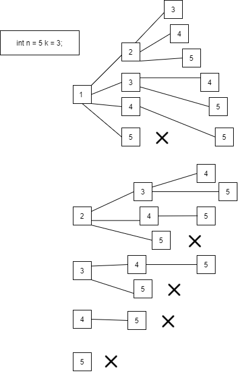
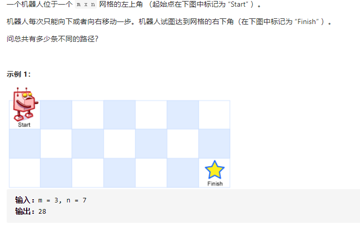
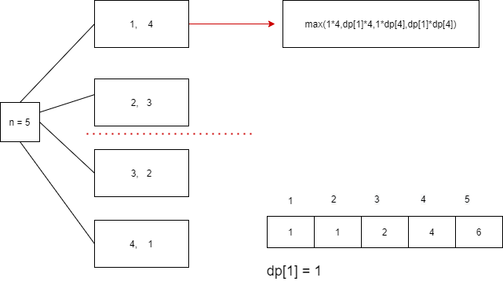

# 回溯

### 组合问题

给定两个整数 n 和 k，返回范围 [1, n] 中所有可能的 k 个数的组合。

你可以按 任何顺序 返回答案。

 

示例 1：

输入：n = 4, k = 2
输出：
[
  [2,4],
  [3,4],
  [2,3],
  [1,2],
  [1,3],
  [1,4],
]
示例 2：

输入：n = 1, k = 1
输出：[[1]]


提示：

1 <= n <= 20
1 <= k <= n

自己写代码：

```cpp
class Solution {
private:
    void backtrack(int m, int & n, int k, vector<int> &vec, vector<vector<int>> &total_vec){
        if (k == 0){
            total_vec.push_back(vec);
            // vec.pop_back();
            return ;
        }
        for (int i = m; i<= n; i++){
            vec.push_back(i);
            backtrack(i + 1, n, k - 1, vec, total_vec);
            vec.pop_back();
        }

    }
public:
    vector<vector<int>> combine(int n, int k) {
        vector<vector<int>> vec1;
        vector<int> vec2;
        backtrack(1, n, k, vec2, vec1);
        return vec1;
    }

};
```

注意一些小细节，传参`vec`要用引用，否则占用内存很大，而且消耗时间长，或者不用传参，直接设置为全局变量。

思路：其实就是穷举+剪枝

模板伪代码：

```
void backtracking(参数) {
    if (终止条件) {
        存放结果;
        return;
    }

    for (选择：本层集合中元素（树中节点孩子的数量就是集合的大小）) {
        处理节点;
        backtracking(路径，选择列表); // 递归
        回溯，撤销处理结果
    }
}
```



交叉为剪枝，每次遍历的集合是上一个集合减去已遍历元素的子集。

# 动态规划

### 股票买卖问题（含手续费）

动态规划：动态方程组+表格记录

```C
int maxProfit(int* prices, int pricesSize, int fee){
    int n = pricesSize;
    int dp[2][n];
    dp[0][0] = 0; dp[1][0] = -prices[0];
    for(int i = 1;i<=n-1;i++)
    {
        dp[0][i] = fmax(dp[0][i-1], dp[1][i - 1] + prices[i] - fee );
        dp[1][i] = fmax(dp[0][i-1] - prices[i], dp[1][i-1]);
    }

    //return fmax(dp[1][n-1],dp[0][n-1]);
    return dp[0][n-1];
}
```

一共有4种状态，`dp[1][i - 1] + prices[i] - fee`代表前一天持有股票今天卖出得到的总收益，`dp[0][i-1] - prices[i]`代表昨天没有持有今天买入的收益，买入所以减去今天价格，其余两种情况均为维持上一天的状态，因此受益就是上一天得到的收益。注释部分：不需要取最后一日两种操作最大值，因为最后一天的操作只可能是卖或继续持有，这两个状态已经在 `dp[0][i]` 里包含了。

|      |   day1    |    day2    | day3 | day4 | day5 |
| :--: | :-------: | :--------: | :--: | :--: | :--: |
|  0   |     0     | two choice |      |      |      |
|  1   | -price[0] | two choice |      |      |      |

### 所有路径



有三种解法，深搜，动规，和数论。

#### 深搜 

此时问题就可以转化为求二叉树叶子节点的个数，代码如下：

```C++
class Solution {
private:
    int dfs(int i, int j, int m, int n) {
        if (i > m || j > n) return 0; // 越界了
        if (i == m && j == n) return 1; // 找到一种方法，相当于找到了叶子节点
        return dfs(i + 1, j, m, n) + dfs(i, j + 1, m, n);
    }
public:
    int uniquePaths(int m, int n) {
        return dfs(1, 1, m, n);
    }
};
```

来分析一下时间复杂度，这个深搜的算法，其实就是要遍历整个二叉树。

这颗树的深度其实就是m+n-1（深度按从1开始计算）。

那二叉树的节点个数就是 2^(m + n - 1) - 1。（假设是完全二叉树）可以理解深搜的算法就是遍历了整个满二叉树（其实没有遍历整个满二叉树，只是近似而已）

所以上面深搜代码的时间复杂度为O(2^(m + n - 1) - 1)，可以看出，这是指数级别的时间复杂度，是非常大的。

#### 动规

```C++
class Solution {
public:
    int uniquePaths(int m, int n) {
        int dp[m][n];
        
        for (int i = 0; i < m; i++){
            for (int j = 0; j < n; j++){
                if (i > 0 && j >0)
                    dp[i][j] = dp[i - 1][j] + dp[i][j - 1];
                else if(i == 0 && j == 0){
                    dp[i][j] = 1;
                }
                else if(i == 0 && j != 0){
                    dp[i][j] = dp[i][j - 1];
                }
                else if(i != 0 && j == 0){
                    dp[i][j] = dp[i - 1][j];
                }
            }
        }
        return dp[m - 1][n - 1];
    }
};
```

#### 数论

在这m + n - 2 步中，一定有 m - 1 步是要向下走的，不用管什么时候向下走。

那么有几种走法呢？ 可以转化为，给你m + n - 2个不同的数，随便取m - 1个数，有几种取法。

那么这就是一个组合问题了。

那么答案，如图所示：

[](https://camo.githubusercontent.com/5d78d86907a2700cf7d8e0ba1c3d4a69629f44d31f285855bc8ef1ae1fe56618/68747470733a2f2f696d672d626c6f672e6373646e696d672e636e2f32303230313230393131333732353332342e706e67)

代码：需要在计算分子的时候，不断除以分母（约分），代码如下：

```C
class Solution {
public:
    int uniquePaths(int m, int n, int array) {
        long long numerator = 1; // 分子
        int denominator = m - 1; // 分母
        int count = m - 1;
        int t = m + n - 2;
        while (count--) {
            numerator *= (t--);
            while (denominator != 0 && numerator % denominator == 0) {
                numerator /= denominator;
                denominator--;
            }
        }
        return numerator;
    }
};
```

#### 字节一道面试题

二维数组，每一个元组内是一个整数，从左上角往右下角走，只能够向右或者向下，要求经过的数的和最少，空间复杂度为O(max(m, n))，其中m为行数，n为列数。

```c++
class Solution {
public:
	int sumInterger(int m, int n, int array[][]){
        int dp[n];
        dp[0] = array[0][0]; //assume the first interger is 1
        for (int j == 1; j < n; j++){
            dp[j] = dp[j - 1] + array[0][j];
        }
        for (int i == 1; i < m; i++){
            for (int j == 0; j < n; j++){
                if (j == 0) dp[j] = array[i][j] + dp[j];
                else {
                    dp[j] = min(dp[j - 1], dp[j]) + array[i][j];
                }
            }
        }
    }
    return dp[n - 1];
};
```

此题二维数组动规方法非常简单，但是题目要求空间复杂度，因此只能用一维数组。

### 整数拆分

给定一个正整数 n，将其拆分为至少两个正整数的和，并使这些整数的乘积最大化。 返回你可以获得的最大乘积。

示例 1:

输入: 2
输出: 1
解释: 2 = 1 + 1, 1 × 1 = 1。
示例 2:

输入: 10
输出: 36
解释: 10 = 3 + 3 + 4, 3 × 3 × 4 = 36。
说明: 你可以假设 n 不小于 2 且不大于 58。

自己写答案：

```C++
class Solution {
public:
    int integerBreak(int n) {
        int dp[n],A,B,m,temp;
        dp[0] = 1;
        int max_num = 0;
        for (int j = 1; j < n; j++){
  
            for (int i = 0; i < (j+1 - 1); i++){
                A = max(dp[i] * (j-i), (i+1) * dp[j - i - 1]);
                B = max((i+1) * (j-i), dp[i] * dp[j - i - 1]);
                temp = max(A, B);
                if (temp > max_num) {
                    max_num = temp;
                }
            }
			dp[j] = max_num;
        }

        return dp[n - 1];
    }

    
};
```

主要思路：




如上图所示，当 n = 5时，我们可以遍历`ceil(n-1/ 2)` 次，拆分的方式我分了四种，但是后来发现`dp[i]*dp[n-i]` 是多余的，这个暂时还不太清楚为什么，dp数组初始化`dp[1] = 1`, 后续逐个算出。改进后代码：四种拆分方法变为两种，遍历n-1次。

```C
class Solution {
public:
    int integerBreak(int n) {
        int dp[n];
        dp[0] = 1;
        int temp = 0;
        for (int j = 1; j < n; j++){
  
            for (int i = 0; i < (j+1 - 1); i++){

                temp = max(temp, max(dp[i] * (j-i), (i+1) * (j-i)));

            }
			dp[j] = temp;
        }

        return dp[n - 1];
    }

    
};
```

