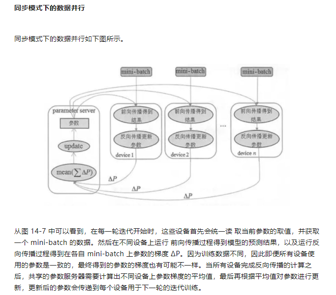

## 优化器

### Gradient Descent

GD方法能够work的原因：

[1]: https://aistudio.baidu.com/aistudio/education/lessonvideo/1149933	"ML 2021"

#### 泰勒展开(Taylor Series)

$$
f(x) = f(x_0) + f(x_0)'(x-x_0)+f(x_0)''(x-x_0)^2/2!+\cdots+f(x_0)^{(n)}(x-x_0)^n/n!
$$

容易验证在某点$x_0$ 处的每一阶导数值都和近似函数导数值相同。
$$
f(x_0) = f(x_0) \\
f'(x_0) = f'(x_0)+2f''(x_0)(x_0-x_0)/2!+\cdots = f'(x_0)\\
f''(x_0) = 2f''(x_0)/2!+3\times2f'''(x_0)(x_0-x_0)/3!+\cdots=f''(x_0)
$$
假设损失函数是$J(\theta)$，让损失函数在某一起始点`(a,b)`开始迭代，在这点的一阶泰勒展开为：
$$
J(\theta)=J(a,b)+\frac{\partial J(\theta)}{\partial a}(\theta_0 - a)+\frac{\partial J(\theta)}{\partial b}(\theta_1 - b)
$$

`J(a,b)`为常数，，两个偏微分也是常数，因此当`(θ-a,θ-b)`与梯度方向相反时，这个inner product的值最小, 因为我们这里是用一阶泰勒展开近似损失函数，因此θ的取值要尽可能地在`(a,b)`的附近，所以需要学习率来控制`(θ-a,θ-b)`的长度在领域范围内，否则导致算法不收敛。

### Adagrad

自适应学习率， 计算梯度越大则离最低点越远，反之越近，但是多变量的情况下有些变量可能里最低点远，但是梯度小，另外的变量里最低点近但梯度大，如下图：


为了解决这个问题，让计算的梯度除以当前点的二阶导数，因为二阶导数某种程度上反应了函数的曲率，二阶导越大，函数变化的越快，一阶导小但二阶导也小，则离最低点远，所以除以二阶导个人认为起到一种正则化的作用。

实际操作中一般不算二阶导，而用过往计算过的一阶导的root mean square当作二阶导的近似。

```python
Require: learning rate lr
Require: Initial parameter θ
		 sum_g = 0
while not achieve the threshold:
	input training samples;
	compute gradient g
	sum_g += g**2
	g_t+1 = g_t - lr*g_t/sqrt(sum_g)
end while
```

### SGD

首先分清`Batch`, 和`mini batch`和`SGD`，使用整个训练集计算累积梯度并进行梯度下降的方法是Batch或`确定性`梯度算法，每次选取一个样本更新的叫stochastic或`在线`算法。`mini batch`是介于上述两种的，每次学一小笔data，但不是全部data。

#### Mini Batch:

```python
def mini_batch(batch_size, data_X, data_Y):
    idx = np.arange(0, data_X.shape[0])
    np.random.shuffle(idx)
    idx = idx[0:batch_size]

    return data_X[idx,:], data_Y[idx,:]
```

```python
X,Y = sliding_window(data_set,9,X,Y)
iter = 20
batch_size = 50
MinMax = preprocessing.MinMaxScaler()

x_scale = MinMax.fit_transform(X)
datax = x_scale
datay = Y
x_batch, y_batch = mini_batch(batch_size, datax,datay)
LR = linear_regression(x_batch,y_batch)
for epoch in range(iter):
    x_batch, y_batch = mini_batch(batch_size, datax,datay)
    LR.X = x_batch          #每次喂入一小笔data
    LR.Y = y_batch
    for i in range(100):
        LR.loss = 0
        LR.train()
        if i % 20 == 0:
            print(LR.loss)
```

`batch_size`的选择一般为2的幂数，一般取值32~256，在某些硬件上使用特定大小是运行时间会更少（花书 P172）。

另外，分batch训练可以实现并行运算：



## Model Selection

### Variance versus Bias

`Variance` 反应的是模型在训练集上的`performance`，`bias`反应在训练集上的`performance`。若在训练集上训练误差很低则bias小，属于`underfitting`，`testing set`上误差高则`variance`大，泛化性能低。

`Testing data`不会用来调整模型。而作为最终的对模型性能的评价,因此需将训练数据分成验证集与训练集，验证集（`validation`）上的performance可以当作指标去改进模型，或有多个模型时选择最好那个。

另外可通过`N-fold validation` 来划分数据集，以防划分方式对模型评估的影响.


## Probabilistic Generative Models

logistics与generative model之间的联系，

#### Posterior Probability

#### Logistics regression 和 Linear regression 的对比


Linear regression的损失函数时`MSE`, Logistics 是`cross entropy`, 最小值都是0，即训练没有误差

```python
### for SGD
def sigmoid(x):
    y = 1/(1+np.exp(x))
    return y


def mini_batch(batch_size, data_X, data_Y):
    idx = np.arange(0, data_X.shape[0])
    np.random.shuffle(idx)
    idx = idx[0:batch_size]

    return data_X[idx,:], data_Y[idx,:]

class logistics_regression():

    def __init__(self,X_train, label):
        self.X = X_train
        self.Y = label
        self.weight1 = np.random.normal(0,0.5,[1,self.X.shape[1]])
        self.b = np.random.normal(0,0.5,[1,1])
        self.lr = 0.1
        self.g_w = np.zeros(self.weight1.shape)
        self.g_b = np.zeros(self.b.shape)
        self.loss = 0
        self.eps = 0.00001

    def train(self):
        m = self.X.shape[0]
        for i in range(m):
            for j in range(5):
                output = self.forward(self.X[i,:])
                gw = (output - self.Y[i,:])*self.X[i,:]
                self.g_w += gw**2
                self.weight1 = self.weight1 + self.lr * gw/(np.sqrt(self.g_w)+self.eps)
                # self.weight1 = self.weight1 + self.lr * gw
                gb = (output - self.Y[i,:])
                self.g_b += gb**2      #adagrad
                self.b = self.b + self.lr * gb/(np.sqrt(self.g_b)+self.eps)
                # self.b = self.b + self.lr * gb

        for j in range(m):
            self.loss += self.Y[j,:]*np.log(self.forward(self.X[j,:]) + self.eps) + (1 - self.Y[j,:])*np.log(1-self.forward(self.X[j,:]) + self.eps)   
        self.loss = -self.loss

    def forward(self, x):
        y_pred = sigmoid(np.dot(self.weight1, x) + self.b)
        # y_pred = np.dot(self.weight1, x) + np.dot(self.weight2, x**2) + self.b
        return y_pred 
```


#### softmax

